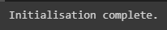
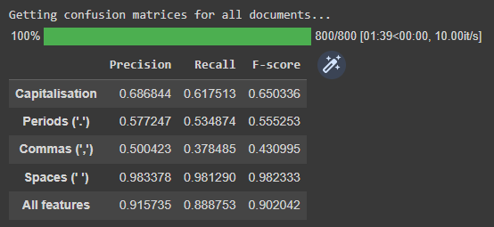
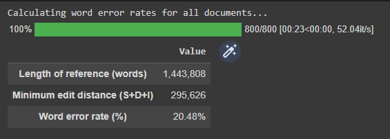

# Feature Restorer Metric Getter

A Python class for calculating precision/recall/F-score and word error rate (WER) metrics for the outputs of feature restoration models against reference strings.

## Getting started

### 1. Clone the repository

Recommended method for Google Colab notebooks:

```python
import sys
# Delete feature-restorer-metric-getter folder to ensures that any changes to the repo are reflected
!rm -rf 'feature-restorer-metric-getter'
# Clone feature-restorer-metric-getter repo
!git clone https://github.com/ljdyer/feature-restorer-metric-getter.git
# Add feature-restorer-metric-getter to PYTHONPATH
sys.path.append('feature-restorer-metric-getter/src')
```

### 2. Install requirements (if required)

If working in Google Colab, the only requirement is `jiwer`, as all other dependencies are installed by default

```python
!pip install jiwer
```

`jiwer` is only required for WER-related features, so you can still use Feature Restorer Metric Getter to calculate precision/recall/F-score metrics without it.

If working in a virtual environment, run the following in the src directory:

```python
pip install -r requirements.txt
```

### 3. Import FeatureRestorerMetricGetter class

```python
from feature_restorer_metric_getter import FeatureRestorerMetricGetter
```

## How to use

You can also check out the example notebook [here](FeatureRestorerMetricGetter_Example.ipynb).

### Initializing a class instance

```python
# ====================
class FeatureRestorerMetricGetter:

    # ====================
    def __init__(self,
                 reference: Str_or_List_or_Series,
                 hypothesis: Str_or_List_or_Series,
                 capitalisation: bool,
                 feature_chars: Str_or_List,
                 get_cms_on_init: bool = True,
                 get_wer_info_on_init: bool = True):
        """
        Initialize an instance of the FeatureRestorerMetricGetter class

        Required arguments:
        -------------------
        reference:                  Either a single string, or a list or
            Str_or_List_or_Series   pandas.Series object of strings
                                    ('documents') to use as the reference
                                    corpus.
        hypothesis:                 Either a single string, or a list or
            Str_or_List_or_Series   pandas.Series object of strings
                                    ('documents') to use as the hypothesis
                                    corpus.
                                    (Number of documents must be the same
                                    as reference.)
        capitalisation: bool        Whether or not to treat capitalisation
                                    as a feature to be assessed.
        feature_chars:              A string or list of characters containing
            Str_or_List             other characters to treat as features
                                    (e.g. '., ' for periods, commas, and
                                    spaces.) 

        Optional keyword arguments:
        ---------------------------
        get_cms_on_init: bool       Whether or not to get confusion matrices
                                    for all reference/hypothesis documents
                                    on intiialization. Set to False to save
                                    time if you do not need precision, recall,
                                    and F-score information or only need it
                                    for a subset of documents.
        get_wer_info_on_init:       Whether or not to calculate WERs for all
            bool                    reference/hypothesis documents on
                                    initialization. Set to False to save time
                                    if you do not need WER information or only
                                    need WER information for a subset of
                                    documents.
        """
```

#### Example usage:

```python
TEST_PATH = 'drive/MyDrive/PAPER/data/ted_talks/ted_test.csv'
RESULTS_PATH = 'drive/MyDrive/PAPER/models/05_bilstm_e2e/english/TedTalks/results.csv'
reference = pd.read_csv(TEST_PATH)['all_cleaned'].to_list()
hypothesis = pd.read_csv(RESULTS_PATH)['results'].to_list()
frmg = FeatureRestorerMetricGetter(reference, hypothesis, True, '., ', False, False)
```

</img>

### Displaying precision, recall, and F-score metrics

```python
    # ====================
    def show_prfs(self,
                  doc_idx: Int_or_Str = 'all',
                  for_latex: bool = False):
        """
        Show precision, recall and F-score for each feature, for
        either a single document all documents.

        Optional keyword arguments:
        ---------------------------
        doc_idx: Int_or_Str         Either an integer indicating the index of
                                    the document to show metrics for, or 'all'
                                    to show metrics for all documents in the
                                    corpus (the default behaviour).
        for_latex: bool             Whether or not to format the output for
                                    LaTeX.
        """
```

#### Example usage:

```python
frmg.show_prfs()
```

</img>

### Displaying confusion matrices

```python
    # ====================
    def show_confusion_matrices(self, doc_idx: Int_or_Str = 'all'):
        """Show confusion matrices for each feature, for either a
        single document or all documents.

        Optional keyword arguments:
        ---------------------------
        doc_idx: Int_or_Str         Either an integer indicating the index of
                                    the document to show confusion matrices
                                    for, or 'all' to show confusion matrices
                                    for all documents in the corpus (the
                                    default behaviour).
        """
```

#### Example usage:

```python
fmrg.show_confusion_matrices()
```

### Displaying WER information

```python
    # ====================
    def show_wer_info(self,
                      doc_idx: Int_or_Str = 'all',
                      for_latex: bool = False):
        """Show minimum edit distance, reference length, and word error rate
        for either a single document or all documents.

        Optional keyword arguments:
        ---------------------------
        doc_idx: Int_or_Str         Either an integer indicating the index of
                                    the document to show confusion matrices
                                    for, or 'all' to show confusion matrices
                                    for all documents in the corpus (the
                                    default behaviour).
        for_latex: bool             Whether or not to format the output for
                                    LaTeX.
        """
```

#### Example usage:

```python
fmrg.show_wer_info()
```

</img>
