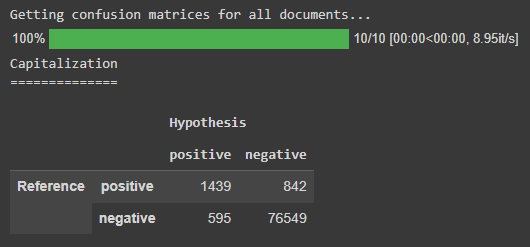

# Feature Restoration Evaluator

A Python library for quantitative and qualitative evaluation of restorations of textual features using machine learning models.

Developed and used for the paper "Comparison of Token- and Character-Level Approaches to Restoration of Spaces, Punctuation, and Capitalization in Various Languages", which is scheduled for publication in December 2022.

## Interactive demo

Check out the interactive demo [here](https://colab.research.google.com/drive/1JkQAEH2uNDQkVl7BNj8vrsOeFbSeGNn_?usp=sharing) to try out the library for yourself in a Google Colab notebook using sample data from the results of the models discussed in the paper.

Alternatively, scroll down for instructions on getting started and basic documentation.

## Getting started

### Install the library using `pip`

```
!pip install git+https://github.com/ljdyer/feature-restoration-evaluator.git
```

### Import the `FeatureRestorationEvaluator` class

```python
from fre import FeatureRestorationEvaluator
```

## Evaluate feature restorations using the `FeatureRestorationEvaluator` class

### Initialize an instance of the `FeatureRestorationEvaluator` class

#### `FeatureRestorationMetricEvaluator.__init__`

```python
    # ====================
    def __init__(self,
                 reference: Str_or_List_or_Series,
                 hypothesis: Str_or_List_or_Series,
                 capitalization: bool,
                 feature_chars: Str_or_List,
                 get_cms_on_init: bool = True,
                 get_wer_info_on_init: bool = True):
        """Initializes an instance of FeatureRestorationEvaluator.

        Args:
          reference (Str_or_List_or_Series):
            Either a single string, or a list or pandas.Series object of
            strings ('documents') to use as the reference corpus.
          hypothesis (Str_or_List_or_Series):
            Either a single string, or a list or pandas.Series object of
            strings ('documents') to use as the hypothesis corpus.
            (Number of documents must be the same as reference.)
          capitalization (bool):
            Whether or not to treat capitalization as a feature to be assessed.
          feature_chars (Str_or_List):
            A string or list of characters containing other characters to treat
            as features (e.g. '., ' for periods, commas, and spaces.)
          get_cms_on_init (bool, optional):
            Whether or not to get confusion matrices for all
            reference/hypothesis documents on intiialization. Set to False to
            save time if you do not need precision, recall, and F-score
            information or only need it for a subset of documents. Defaults to
            True.
          get_wer_info_on_init (bool, optional):
            Whether or not to calculate WERs for all reference/hypothesis
            documents on initialization. Set to False to save time if you do
            not need WER information or only need WER information for a subset
            of documents. Defaults to True.

        Raises:
          ValueError:
            Hypothesis and reference lists must have equal length.
        """
```

#### Example usage:

```python
my_fre = FeatureRestorationEvaluator(
    sample_data['reference'],
    sample_data['BiLSTMCharE2E_result'],
    capitalization=True,
    feature_chars='., '
)
```

</img>

### Show precision, recall, and F-score metrics

#### `FeatureRestorationMetricEvaluator.show_prfs`

```python
    # ====================
    def show_prfs(self,
                  doc_idx: Int_or_Str = 'all',
                  for_latex: bool = False):
        """Show precision, recall and F-score for each feature, for
        either a single document all documents.

        Args:
          doc_idx (Int_or_Str, optional):
            Either an integer indicating the index of the document to
            show metrics for, or 'all' to show metrics for all documents
            in the corpus. Defaults to 'all'.
          for_latex (bool, optional):
            Whether or not to format the output for LaTeX.
            Defaults to False.
        """
```

#### Example usage:

```python
my_fre.show_prfs()
```

</img>

### Show confusion matrices

#### `FeatureRestorationMetricEvaluator.show_confusion_matrices`

```python
    # ====================
    def show_confusion_matrices(self,
                                doc_idx: Int_or_Str = 'all',
                                features_to_show: List[str] = None):
        """Show confusion matrices for each feature, for either a
        single document or all documents.

        Args:
          doc_idx (Int_or_Str, optional):
            Either an integer indicating the index of the document to
            show confusion matrices for, or 'all' to show confusion
            matrices for all documents in the corpus. Defaults to 'all'.
          features_to_show (List[str]):
            Features to show confusion matrices for. If None, show
            confusion matrics for all features. Defaults to None.
        """
```

#### Example usage:

```python
my_fre.show_confusion_matrices('all', ['CAPS'])
```

</img>

### Show word error rate (WER) information

#### `FeatureRestorationMetricEvaluator.show_wer_info`

```python
    # ====================
    def show_wer_info(self,
                      doc_idx: Int_or_Str = 'all',
                      for_latex: bool = False):
        """Show minimum edit distance, reference length, and word error rate
        for either a single document or all documents.

        Args:
          doc_idx (Int_or_Str, optional):
            Either an integer indicating the index of the document to show
            confusion matrices for, or 'all' to show confusion matrices for
            all documents in the corpus.
          for_latex (bool, optional):
            Whether or not to format the output for LaTeX. Defaults to False.
        """
```

#### Example usage:

```python
my_fre.show_wer_info()
```

</img>

### Display the hypothesis document with false positives and false negatives highlighted

#### `FeatureRestorationMetricEvaluator.show_text_display`

```python
    # ====================
    def show_text_display(self,
                          doc_idx: int,
                          start_char: int = None,
                          chars_per_row: int = None,
                          num_rows: int = None,
                          for_latex: bool = False,
                          ignore: list = None):
        """Display a hypothesis document with false positives and false
        negatives highlighted.

        Args:
          doc_idx (int):
            The index of the document to display.
          start_char (int, optional): 
            The character to display from. If None, displays from beginning
            of document. Defaults to None.
          chars_per_row (int, optional):
            The number of characters to display per row. If None, no line break
            characters will be inserted so the display will break according to
            the line breaking rules in the environment. Defaults to None.
          num_rows (int, optional):
            Number of rows to display. Defaults to None.
          for_latex (bool, optional):
            Whether to render the output for LaTeX. Defaults to False.
          ignore (list, optional):
            A list of features to ignore (e.g. ['.', ',']). Defaults to None.
        """
```

#### Example usage:

```python
my_fre.show_text_display(0, num_rows=5, chars_per_row=40)
```

</img>

### Display a list of errors for a given feature in a given document

#### `FeatureRestorationMetricEvaluator.show_feature_errors`

```python
    # ====================
    def show_feature_errors(self,
                            doc_idx: int,
                            feature_to_check: str,
                            chars_either_side: int = 10):
        """Display a list of errors for a given feature in a given
        document.

        Args:
          doc_idx (int):
            The index of the document to show errors for.
          feature_to_check (str):
            The feature to show errors for (e.g. '.')
          chars_either_side (int, optional):
            The number of characters to display either side of the error.
            Defaults to 10.
        """
```

#### Example usage:

```python
my_fre.show_feature_errors(0, '.')
```

</img>